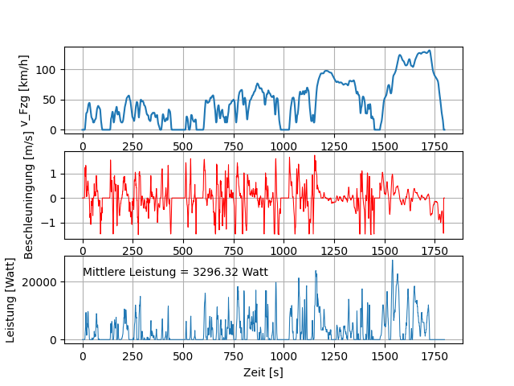

# WLTP-Zyklus
Python Skript zur Auswertung des WLTP-Geschwindigkteitsverlaufs. 

Das Python-Skript liest über cycle_data.txt den Gewschwindigkeitsverlauf über Zeit ein und stellt diesen grafisch dar. 

Zusätzlich werden der Beschleunigungsverlauf über Zeit und die momentane Antriebsleistung über Zeit berechnet und ebenfalls als Grafik ausgegeben: 

